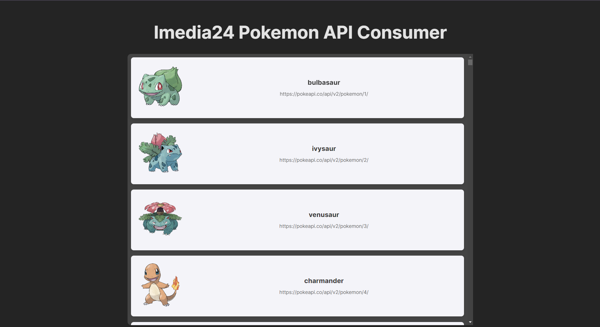
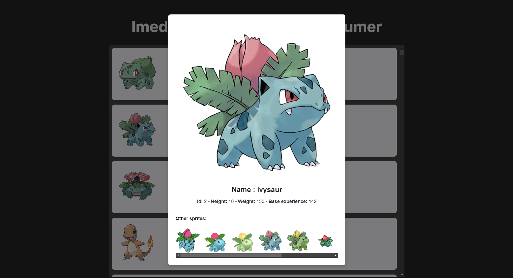

# Pokemon App

This is a simple React application built with Vite that consumes the Pokémon API to display Pokémon data.

  



## Getting Started

Follow these steps to set up and run the project.

### 1. Install Dependencies

First, clone the repository and navigate to the project directory. Then, run the following command to install the necessary dependencies:

```bash
npm install
```

### 2. Start the Development Server

To start the development server and open the app in your default browser, use:

```bash
npm run dev
```

The application will be available at http://localhost:3000.